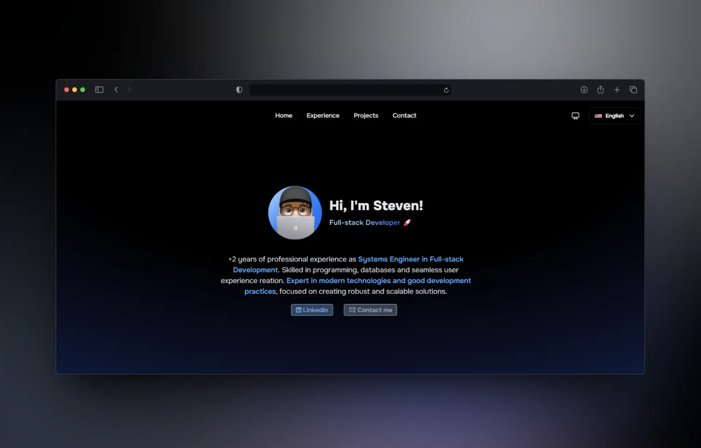

# Personal Portfolio of Jamid Stiven Villarreal Rugeles

Welcome to my personal portfolio! Here you will find a compilation of my projects, skills and experience as a systems engineer and Full-stack web developer.

## Description

This repository contains source code from my personal portfolio, designed to showcase my skills and experience in software development, with a focus on scalable solutions, modern user interfaces, and good development practices.

## 📨 Contact me

If you wish to contact me, you can do so through the following means:

- **Email:** stivenvillarreal@gmail.com
- **Linkedin:** https://linkedin.com/in/stivenvr
